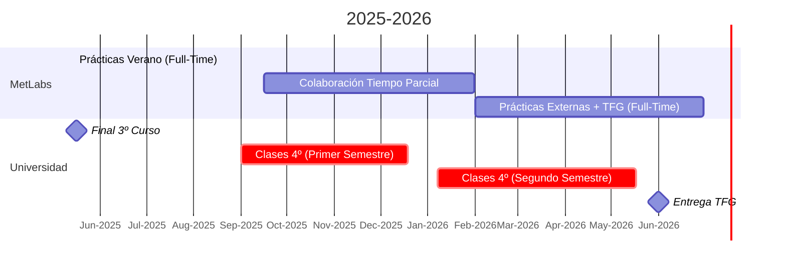

# Propuesta de Disponibilidad para Prácticas y Incorporación Posterior

## Introducción

Plan académico y disponibilidad para realizar prácticas a tiempo completo durante el verano y mi flexibilidad en el inicio del 4º curso, con posibilidad de continuar en la empresa tras finalizar el periodo de prácticas.

**Contexto Académico**:

Finalizo 3º año de Ingeniería de Sistemas Inteligentes[^1] el 15 de mayo.

Matriculado en 4º curso, con una estructura dividida en dos semestres. (5 + 5 asignaturas)

### Asignaturas 4º curso

| Semestre         | Asignatura                                   | Tipo | ECTS |
|------------------|----------------------------------------------|------|------|
| **Primer Semestre** | Sistemas Interactivos Inteligentes        | OB   | 6    |
|                  | Empresa Inteligente y Gemelos Digitales      | OB   | 6    |
|                  | Computación Cuántica y Natural               | OB   | 6    |
|                  | Configuración Electiva I                     | OP   | 6    |
|                  | Configuración Electiva II                    | OP   | 6    |
| **Segundo Semestre** | Trabajo Fin de Grado (TFG)               | TFG  | 12   |
|                  | Práctica Externa Curricular I (PE)           | PE   | 6    |
|                  | Práctica Externa Curricular II (PE)          | PE   | 6    |
|                  | Configuración Electiva III                   | OP   | 6    |

---

## Detalle del Plan Académico y de Prácticas

### Prácticas de Verano (Mayo - Septiembre)

**Objetivo**: Cubrir 3 asignaturas optativas del 4º año.

**Créditos**: Cada asignatura cuenta con 6 créditos, a 25 horas por crédito.

**Total de horas**: 3 asignaturas × 6 créditos × 25 horas = 450 horas.

**Carga horaria semanal**: Aproximadamente 35 horas semanales, lo que equivale a unas 12-13 semanas.

### Estructura del 4º Curso

**Primer Semestre** (a partir de septiembre):

Realizaré solo 3 asignaturas (en vez de 5), lo que me permite asistir a clases 3 días a la semana.

Esto posibilita trabajar a tiempo parcial o completo según se requiera.

**Segundo Semestre** (a partir de enero 2026):

Una asignatura optativa adicional estará cubierta por las prácticas de verano.

Además, se completarán las prácticas obligatorias que se realizan en la empresa.

**Trabajo Fin de Grado** (TFG):

Se puede convalidar como un trabajo en la empresa, integrándose al desarrollo del proyecto empresarial.

### **📅 Cronograma de Disponibilidad**  

| Período                    | Disponibilidad           | Horas/Semana | Detalles Académicos                                                            |
|----------------------------|--------------------------|--------------|--------------------------------------------------------------------------------|
| **15 Mayo - 1 Sept 2025**  | 🟢 **Tiempo Completo**   | 35h          | - Prácticas intensivas (450h). - Convalida 3 optativas (18 ECTS).           |
| **Sept 2025 - Dic 2025**   | 🟡 **Tiempo Parcial**    | 20h[^2]      | - Clases: 3 días/semana (18 ECTS obligatorios). - TFG en fase inicial.      |
| **Ene 2026**               | 🟢 **Tiempo Completo**   | 40h          | - TFG + Prácticas Externas I y II (24 ECTS). - Sin asignaturas pendientes.  |

---

### **📊 Visualización Mensual**

Leyenda:

🟢 Tiempo Completo: 35-40h/semana (sin restricciones académicas).

🟡 Tiempo Parcial: Compatibilidad con clases (horario flexible).

🔵 Hitos Académicos: Fechas críticas (ej: entregas TFG).

### **📅 Visualizacion Semanal (Septiembre-Diciembre 2025)**

| Día           | Actividad                           | Horario       |
|---------------|-------------------------------------|---------------|
| **Lunes**     | Clase: Sistemas Interactivos        | 10:00 - 14:00 |
|               | Trabajo Tiempo Parcial              | 15:30 - 19:30 |
| **Martes**    | Trabajo Tiempo Completo             | 10:00 - 18:00 |
| **Miércoles** | Clase: Gemelos Digitales            | 10:00 - 14:00 |
|               | Trabajo Tiempo Parcial              | 15:30 - 19:30 |
| **Jueves**    | Trabajo Tiempo Completo             | 08:30 - 17:30 |
| **Viernes**   | Clase: Computación Cuántica         | 10:00 - 14:00 |
|               | Trabajo Tiempo Parcial              | 15:30 - 19:30 |
| **Sábado**    | Trabajo Tiempo Parcial              | 09:00 - 14:00 |

>[!INFO]
>Los horarios de clase aun no estan definidos

### Distribución Detallada

| Categoría                                   | Horas/Semana          |
|---------------------------------------------|-----------------------|
| Trabajo Tiempo Completo + Parcial           | 21h + 12h (33h)       |
| Clases Presenciales + Estudio Autonomo      | 12h + 12h (24h)       |

---

### Notas Clave

**Verano 2025**: Máxima disponibilidad para integrarme en proyectos de MetLabs.

**Septiembre-Diciembre 2025**: Flexibilidad para ajustar horarios (ej: lunes/miércoles/viernes en clases, resto días en empresa).

**Enero 2026**: Compromiso total con MetLabs (TFG + prácticas curriculares).

[^1]: [Grado en Ingeniería en Sistemas Inteligentes - UIE](https://uie.edu/grado/grado-en-ingenieria-en-sistemas-inteligentes/)

[^2]: Al tener 3 asignaturas por semana tendria 3 mañanas/tardes (aun por definir) ocupadas y 3 días libres, contando el sábado, por lo que podria incluso estar disponible 3 días completos y 3 días a tiempo parcial, preferiblemente desde casa esos días.
